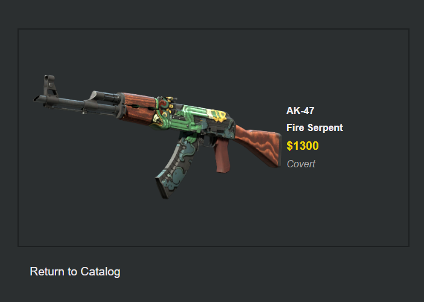

# CS2 Skins Catalog

A responsive, browser-based catalog for showcasing **Counter-Strike 2 (CS2)** skins. The app reads data from an XML file and allows users to view, explore, and sort skins by weapon.

## 🚀 Features

- 🧾 **XML-Driven Catalog** – Loads CS2 skin data from a structured XML file
- 🖼️ **Skin Thumbnails** – Shows each item's image, name, rarity, and price
- 🔁 **Sorting** – Dropdown to sort skins by weapon (ascending or descending)
- 🔍 **Detail View** – Click any skin to view full details
- 🎨 **Custom Styling** – Dark-themed UI with responsive design

--- 

## 🛠️ Technologies Used

- PHP (server-side rendering)
- JavaScript (dynamic sorting)
- HTML/CSS (custom styles via `style.css`)
- XML (data source)
- Fonts: Roboto, Orbitron, Montserrat

--- 

## 📂 File Structure
```plaintext
cs2skins-phpjs/
├── .git/               # Git repository folder
├── css/
│   └── style.css       # Stylesheet for the entire site
├── images/             # Contains all skin image assets
├── js/
│   └── script.js       # Handles sorting functionality
├── xml/
│   └── cs2skins.xml    # XML file containing skin data
├── index.php           # Main catalog page (skin grid + sort menu)
├── item.php            # Skin detail page (for individual skin info)
└── README.md           # Project overview and usage instructions
```

--- 

## 🧪 Usage Instructions

1. 📥 **Download or Clone the Repository**
   ```bash
   git clone https://github.com/lucasziiN/cs2skins-phpjs.git
   ```

2. 📁 Place the folder in XAMPP's htdocs
    ```plaintext
    C:\xampp\htdocs\cs2-skins-catalog\
    ```
3. ▶️ Start Apache from the XAMPP Control Panel

4. 🌐 Open your browser and visit:
```plaintext
    http://localhost/cs2-skins-catalog/index.php
```

--- 

## 🖼️ Screenshots



--- 

## 📌 Notes
Ensure your images/ folder includes all referenced PNGs in cs2skins.xml

Sorting works via the <select> dropdown at the top right

--- 

## 👨‍🎓 Author
Lucas Oda
Bachelor of Science (Computer Science)
University of Waikato – COMPX304 (2025)